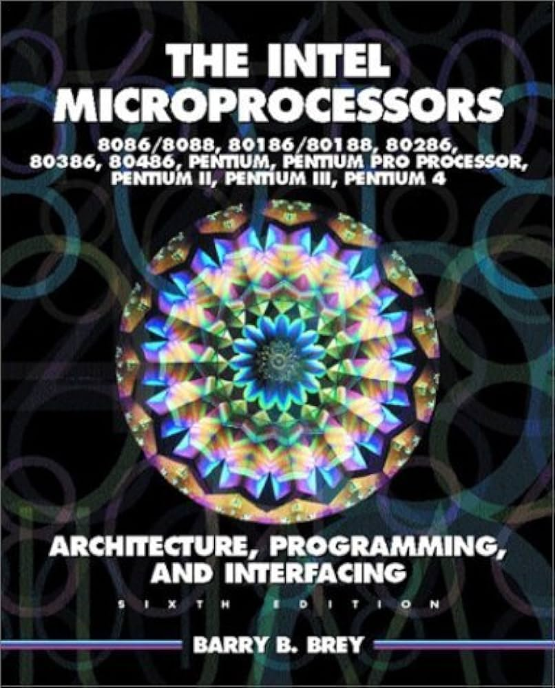
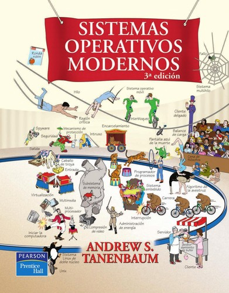

  

    
  

<h1 align="center">
  Herman Semenoff
</h1>

## About me

I have HPC and Security Team, team contains only AI agents and me.

I love architectural x64, mips64 optimizations, cache management, and branch prediction.

I'm always trying to improve everything, and I have a lot of closed forks of large projects.

Sometimes, out of boredom, I can open them and merge changes to mainline branch of the project.

I don't have much time for constant activity in opensource, I often make changes and forget to finish something.

## Stack
- Langs: C Linux, C++ Qt/Winapi/Borland, NASM, FASM, MASM, UASM
- Disassemblers: radare2/rizin, Cutter, Ida Pro, Ghidra, x64dbg
- and others static, dynamic and fuzzing analyzers

## My open forks
 - [WinRing0](https://github.com/GermanAizek/WinRing0) 

Microsoft refused to cooperate with me, they do not issue an EV certificate to fix driver vulnerability. Many thanks Gamers Nexus team for highlighting this global issue on Windows.

 

    <iframe width="560" height="315" src="https://www.youtube.com/embed/H_O5JtBqODA" title="YouTube video player" frameborder="0" allow="accelerometer; autoplay; clipboard-write; encrypted-media; gyroscope; picture-in-picture; web-share" referrerpolicy="strict-origin-when-cross-origin" allowfullscreen></iframe>

 - [WebDriverxx](https://germanaizek.github.io/webdriverxx/) (Client C++ API for Selenium Server - test automation for browser-based web applications)
 - [PicoBase64](github.com/GermanAizek/picobase64) (very fast and lightweight header-only C/C++ library for decode and encode strings. [Bechmarks here!](https://rawcdn.githack.com/gaspardpetit/base64/294fac8a0e679cbe72f0a3d6f40e1a3bccba7c5d/result/result.html))
 - [AQEMU](https://github.com/AQEMU/aqemu) (Im continue maintain AQEMU)
 - [midi2mod](https://github.com/GermanAizek/midi2mod) (for demoscene and old keygens fans)
 - [NUMAyei](https://github.com/GermanAizek/NUMAyei) (attempt make Windows more NUMA-awarless using DLL hijacking winapi calls)
 - [LibreAward](https://github.com/GermanAizek/libreaward) (attempt make [Award BIOS](https://en.wikipedia.org/wiki/Award_Software) free opensource and modifyable)
 - [MT7601 driver linux](https://github.com/GermanAizek/mt7601u-hacker) (maintance Mediatek 7601U WiFi driver for Linux)
 - [LXOpenbox](https://github.com/LXunix/lxopenbox) (my Openbox fork)
 - [LXPulseAudio](https://github.com/LXunix/lxpulseaudio) (my Pulseaudio fork)
 - [LibreGoanna](https://github.com/LXunix/libregoanna-uxp) (my PaleMoon/Basilisk browser fork)
 - [and others this](https://github.com/GermanAizek?tab=repositories)

## My favorite books

  

    
    
  

## My favorite teacher

  

    
  

<h4 align="center">
  Edward Numbless
</h4>

## For commercial inquiries and press releases
 - <[GermanAizek@yandex.ru](mailto:GermanAizek@yandex.ru)>
 - <[germanaizek0@gmail.com](mailto:germanaizek0@gmail.com)>
 - <[GermanAizek@tutamail.com](mailto:GermanAizek@tutamail.com)>

